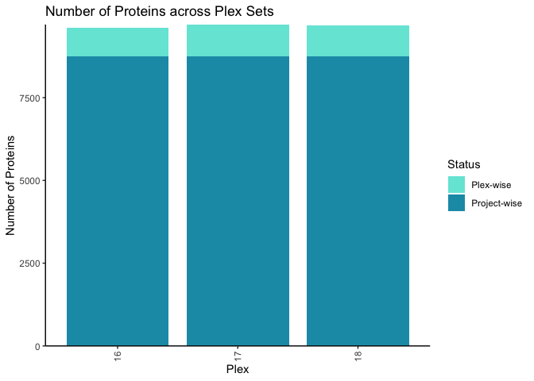

# FragPipeAnalystR

R package for FragPipe downstream analysis

## Installation

We recommend to use [renv](https://rstudio.github.io/renv/index.html) for managing your R environment dependencies

``` r
renv::install("bioc::ComplexHeatmap")
renv::install("bioc::limma")
renv::install("bioc::MSnbase")
renv::install("bioc::SummarizedExperiment")
renv::install("bioc::cmapR")
renv::install("bioc::ConsensusClusterPlus")
renv::install("Nesvilab/FragPipeAnalystR")

# optional
renv::install("nicolerg/ssGSEA2")
```

## Example

```
library(FragPipeAnalystR)
data("ccrcc", package = "FragPipeAnalystR")
```

```
plot_pca(ccrcc)
```


```
plot_missval_heatmap(ccrcc)
```


```
plot_correlation_heatmap(ccrcc)
```


```
plot_feature_numbers(ccrcc)
```




## Developer guide
- Start project `renv::init()`:
You may see message similar to this
```
* Using Bioconductor version '3.18'.
This project already has a lockfile. What would you like to do? 

1: Restore the project from the lockfile.
2: Discard the lockfile and re-initialize the project.
3: Activate the project without snapshotting or installing any packages.
4: Abort project initialization.
```
We recommend to choose 2 here to initialize the project since some dependencies depend on the R version and bioconductor version use
- You may use `lintr::lint_package()` and `styler::style_pkg()` to make sure coding styles consistent
- `devtools::build()` and `devtools::test()` to build and test the package, respectively
- `devtools::document()` when you add a function
- `usethis::use_import_from("package name", "function name")` to include dependencies

