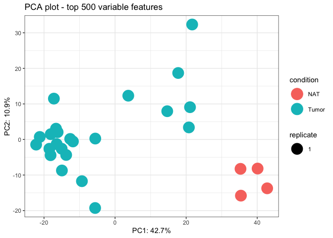
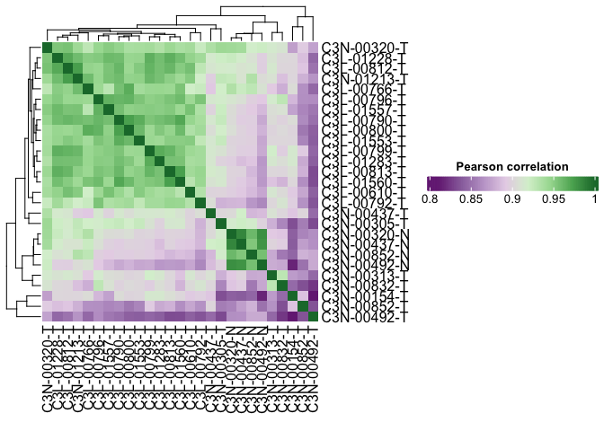
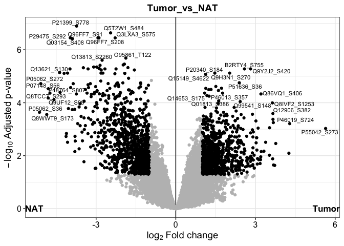

```r
library(FragPipeAnalystR)
```

## Introduction
One of the reasons we created `FragPipeAnalystR` is to support peptide-level analysis of post-translational modifications (PTM). Here, we used three plex sets of TMT phosphoproteomics experiemnt from the previously published [clear cell renal cell carcinoma study (ccRCC)](https://www.sciencedirect.com/science/article/pii/S0092867419311237?via%3Dihub). After the phosphoproteomics data is processed by FragPipe, you should be able to get the reports produced by TMT-Integrator. Or you can download the report used in the tutorial [here](https://drive.google.com/drive/u/2/folders/1x8DCxGKdsZQmYGsv3vSWfj1IYRPzykmT).

## Read the data

The first step is always the same to read the data. Note that we specify the `level` and `exp_type` here.

```r
se <- make_se_from_files("/Users/hsiaoyi/Documents/workspace/Fragpipe-Analyst-Datasets/TMT/ccRCC_p_nccRCC_plex/abundance_single-site_MD.tsv", "/Users/hsiaoyi/Documents/workspace/Fragpipe-Analyst-Datasets/TMT/ccRCC_p_nccRCC_plex/experiment_annotation_annotated.tsv", level="peptide", type = "TMT", exp_type="phospho")
```

## QC plots

Then, you should able to observe the data through various plots supported. For example, the PCA plot 

```r
plot_pca(se)
```

<!-- -->

or heatmap

```r
plot_correlation_heatmap(se)
```

<!-- -->

Both of these plots show that protein phosphorylation status of tumor and normal adjacent tumors (NATs) is quite different.

## Differential expression (DE) analysis

One of the frequent analysis we do is differential expression analysis to understand the difference between tumor and NAT. It can be performed through following commands:


```r
de_result <-test_limma(se, type = "all")
```

```
## Tested contrasts: Tumor_vs_NAT
```

```r
de_result_updated <- add_rejections(de_result)
plot_volcano(de_result_updated, "Tumor_vs_NAT")
```

<!-- -->

As you can see, there are many phosphosites upregulated and downregulated in this comparison. This gives a lot of research opportunities. For example, CAK2 (P51636) has been associated with [maintaining kidney cancer malignant](https://pubmed.ncbi.nlm.nih.gov/30288056/). Further investigating this phoshphosite (S36) might help us understand its mechanism. One thing that needs to be noted here is that the abundance of phosphopeptides is usually correlated with its protein abundance, so it might be just because the protein abundance of CAK2 is upregulated in ccRCC. It might be worth to check with the global proteome available as well. 

## Enrichment analysis
One of the key difference between peptide-level analysis of PTMs we demonstrated here and protein level analysis is that PTMs usually act in a site-specific manner. Here, we also provide the way to help users perform enrichment analysis site-specifically through creating the input file you needed for [PTM-SEA](https://doi.org/10.1074/mcp.tir118.000943).

```r
prepare_PTMSEA(de_result_updated, "Tumor_vs_NAT_diff", "./result.gct")
```

```
## Saving file to  ./result.gct 
## Dimensions of matrix: [22462x1]
## Setting precision to 4
## Saved.
```

Then, you can run PTM-SEA though [ssGSEA2 R package](https://github.com/nicolerg/ssGSEA2) like this:

```r
library(ssGSEA2)
res <- run_ssGSEA2("./result.gct",
                   output.prefix = "ccRCC",
                   gene.set.databases = "./ptm.sig.db.all.flanking.human/ptm.sig.db.all.flanking.human.v2.0.0.gmt",
                   output.directory = "./PTMSEA_result",
                   sample.norm.type = "none", 
                   weight = 0.75, 
                   correl.type = "rank", 
                   statistic = "area.under.RES",
                   output.score.type = "NES", 
                   nperm = 1000, 
                   min.overlap = 5, 
                   extended.output = T,
                   global.fdr = FALSE,
                   par=T,
                   spare.cores=4,
                   log.file = "./ccRCC_PTMSEA.log")
```

and visualize the result through:


```r
# visualize_PTMSEA("./PTMSEA_result/ccrcc-combined.gct", "Tumor_vs_NAT_diff")
```

