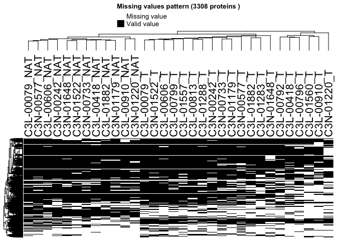
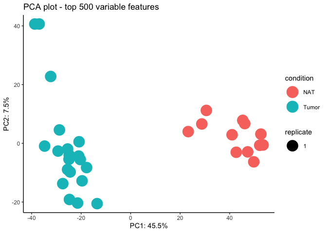
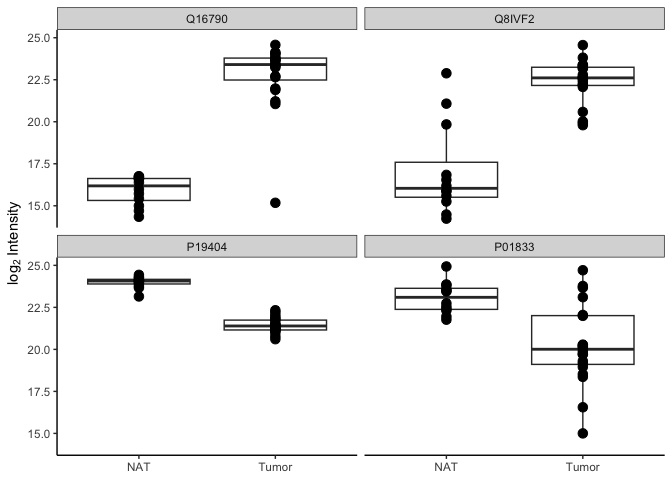

# Introduction

FragPipeAnalystR is a R package intended for downstream analysis of data generated from [FragPipe](https://fragpipe.nesvilab.org/). Here we demonstrated the utility of FragPipeAnalyst by reanalyzing a clear cell renal cell carcinoma (ccRCC) data-independent acquisition (DIA) data collected by CPTAC. You can download the example files from [here](https://zenodo.org/records/13147961). Files are in "DIA_4plex" folder.

## CCRCC DIA data

As described in the manuscript, DIA ccRCC data were fetched from [Clark et al. (2019)](https://doi.org/10.1016/j.cell.2019.10.007) and processed via [FragPipe](https://fragpipe.nesvilab.org/). As you will see in the following sections. The result is quite similar to corresponding TMT data.


``` r
library(FragPipeAnalystR)
```

```
## 
```

``` r
ccrcc <- make_se_from_files("/Users/hsiaoyi/Documents/workspace/FragPipeR_manuscript/data/DIA_4plex/diann-output.pg_matrix.tsv",
                         "/Users/hsiaoyi/Documents/workspace/FragPipeR_manuscript/data/DIA_4plex/experiment_annotation_clean.tsv",
                         type = "DIA")
```


``` r
print(head(rownames(ccrcc)))
```

```
## [1] "A0A024RBG1" "A0A075B6H7" "A0A075B6H9" "A0A075B6I0" "A0A075B6I4"
## [6] "A0A075B6I9"
```


``` r
plot_pca(ccrcc)
```

<!-- -->


``` r
plot_correlation_heatmap(ccrcc)
```

<!-- -->


``` r
plot_missval_heatmap(ccrcc)
```

```
## `use_raster` is automatically set to TRUE for a matrix with more than
## 2000 rows. You can control `use_raster` argument by explicitly setting
## TRUE/FALSE to it.
## 
## Set `ht_opt$message = FALSE` to turn off this message.
```

```
## 'magick' package is suggested to install to give better rasterization.
## 
## Set `ht_opt$message = FALSE` to turn off this message.
```

<!-- -->


``` r
plot_feature_numbers(ccrcc)
```

<!-- -->


``` r
plot_feature(ccrcc, c("Q16790", # CA9
                      "Q8IVF2", # AHNAK2
                      "P19404", # NDUFV2
                      "P01833" # PIGR
                      ))
```

<!-- -->

## Imputation


``` r
imputed <- manual_impute(ccrcc)
```


``` r
plot_pca(imputed)
```

<!-- -->


``` r
plot_feature(imputed,  c("Q16790", # CA9
                      "Q8IVF2", # AHNAK2
                      "P19404", # NDUFV2
                      "P01833" # PIGR
                      ))
```

<!-- -->

## DE result without imputation

``` r
de_result <- test_limma(ccrcc, type = "all")
```

```
## Tested contrasts: Tumor_vs_NAT
```

``` r
de_result_updated <- add_rejections(de_result)
plot_volcano(de_result_updated, "Tumor_vs_NAT")
```

<!-- -->

## DE result with imputation

``` r
de_result <- test_limma(imputed, type = "all")
```

```
## Tested contrasts: Tumor_vs_NAT
```

``` r
de_result_updated <- add_rejections(de_result)
plot_volcano(de_result_updated, "Tumor_vs_NAT")
```

<!-- -->

One of the differences between differential expression analysis results from unimputed and imputed data is CA9 (Carbonic anhydrase 9, Q16790) which is a [known marker of clear cell renal cell carcinoma](https://doi.org/10.1016/j.ejca.2010.07.020). Its expression is missing in the normal data, which leads its absence of unimputed data.


``` r
sessionInfo()
```

```
## R version 4.4.1 (2024-06-14)
## Platform: aarch64-apple-darwin20
## Running under: macOS Ventura 13.4
## 
## Matrix products: default
## BLAS:   /Library/Frameworks/R.framework/Versions/4.4-arm64/Resources/lib/libRblas.0.dylib 
## LAPACK: /Library/Frameworks/R.framework/Versions/4.4-arm64/Resources/lib/libRlapack.dylib;  LAPACK version 3.12.0
## 
## locale:
## [1] en_US.UTF-8/en_US.UTF-8/en_US.UTF-8/C/en_US.UTF-8/en_US.UTF-8
## 
## time zone: America/Detroit
## tzcode source: internal
## 
## attached base packages:
## [1] stats     graphics  grDevices datasets  utils     methods   base     
## 
## other attached packages:
## [1] FragPipeAnalystR_1.0.5
## 
## loaded via a namespace (and not attached):
##   [1] RColorBrewer_1.1-3          rstudioapi_0.17.1          
##   [3] jsonlite_1.8.9              shape_1.4.6.1              
##   [5] MultiAssayExperiment_1.32.0 magrittr_2.0.3             
##   [7] ggtangle_0.0.6              farver_2.1.2               
##   [9] MALDIquant_1.22.3           rmarkdown_2.29             
##  [11] GlobalOptions_0.1.2         fs_1.6.5                   
##  [13] zlibbioc_1.52.0             vctrs_0.6.5                
##  [15] memoise_2.0.1               ggtree_3.14.0              
##  [17] htmltools_0.5.8.1           S4Arrays_1.6.0             
##  [19] gridGraphics_0.5-1          SparseArray_1.6.1          
##  [21] mzID_1.44.0                 sass_0.4.9                 
##  [23] bslib_0.9.0                 htmlwidgets_1.6.4          
##  [25] plyr_1.8.9                  plotly_4.10.4              
##  [27] impute_1.80.0               cachem_1.1.0               
##  [29] igraph_2.1.4                lifecycle_1.0.4            
##  [31] iterators_1.0.14            pkgconfig_2.0.3            
##  [33] gson_0.1.0                  Matrix_1.7-0               
##  [35] R6_2.5.1                    fastmap_1.2.0              
##  [37] GenomeInfoDbData_1.2.13     MatrixGenerics_1.18.1      
##  [39] clue_0.3-66                 fdrtool_1.2.18             
##  [41] aplot_0.2.4                 digest_0.6.37              
##  [43] enrichplot_1.26.6           pcaMethods_1.98.0          
##  [45] colorspace_2.1-1            patchwork_1.3.0            
##  [47] AnnotationDbi_1.68.0        S4Vectors_0.44.0           
##  [49] GenomicRanges_1.58.0        RSQLite_2.3.9              
##  [51] labeling_0.4.3              cytolib_2.18.2             
##  [53] httr_1.4.7                  abind_1.4-8                
##  [55] compiler_4.4.1              withr_3.0.2                
##  [57] bit64_4.6.0-1               doParallel_1.0.17          
##  [59] ConsensusClusterPlus_1.70.0 BiocParallel_1.40.0        
##  [61] DBI_1.2.3                   ExPosition_2.8.23          
##  [63] R.utils_2.12.3              MASS_7.3-60.2              
##  [65] prettyGraphs_2.1.6          DelayedArray_0.32.0        
##  [67] rjson_0.2.23                mzR_2.40.0                 
##  [69] tools_4.4.1                 PSMatch_1.10.0             
##  [71] ape_5.8-1                   R.oo_1.27.0                
##  [73] glue_1.8.0                  nlme_3.1-164               
##  [75] QFeatures_1.16.0            GOSemSim_2.32.0            
##  [77] grid_4.4.1                  cmapR_1.18.0               
##  [79] cluster_2.1.6               reshape2_1.4.4             
##  [81] fgsea_1.32.2                generics_0.1.3             
##  [83] gtable_0.3.6                tzdb_0.4.0                 
##  [85] R.methodsS3_1.8.2           preprocessCore_1.68.0      
##  [87] tidyr_1.3.1                 hms_1.1.3                  
##  [89] data.table_1.16.4           XVector_0.46.0             
##  [91] BiocGenerics_0.52.0         ggrepel_0.9.6              
##  [93] foreach_1.5.2               pillar_1.10.1              
##  [95] stringr_1.5.1               yulab.utils_0.2.0          
##  [97] limma_3.62.2                flowCore_2.18.0            
##  [99] circlize_0.4.16             splines_4.4.1              
## [101] dplyr_1.1.4                 treeio_1.30.0              
## [103] lattice_0.22-6              renv_1.1.0                 
## [105] bit_4.5.0.1                 RProtoBufLib_2.18.0        
## [107] tidyselect_1.2.1            GO.db_3.20.0               
## [109] ComplexHeatmap_2.22.0       Biostrings_2.74.1          
## [111] alluvial_0.1-2              knitr_1.49                 
## [113] IRanges_2.40.1              ProtGenerics_1.38.0        
## [115] SummarizedExperiment_1.36.0 stats4_4.4.1               
## [117] xfun_0.50                   Biobase_2.66.0             
## [119] statmod_1.5.0               MSnbase_2.32.0             
## [121] matrixStats_1.5.0           stringi_1.8.4              
## [123] UCSC.utils_1.2.0            ggfun_0.1.8                
## [125] lazyeval_0.2.2              yaml_2.3.10                
## [127] evaluate_1.0.3              codetools_0.2-20           
## [129] MsCoreUtils_1.18.0          tibble_3.2.1               
## [131] qvalue_2.38.0               BiocManager_1.30.25        
## [133] ggplotify_0.1.2             cli_3.6.3                  
## [135] affyio_1.76.0               munsell_0.5.1              
## [137] jquerylib_0.1.4             Rcpp_1.0.14                
## [139] GenomeInfoDb_1.42.3         png_0.1-8                  
## [141] XML_3.99-0.18               parallel_4.4.1             
## [143] assertthat_0.2.1            readr_2.1.5                
## [145] ggplot2_3.5.1               blob_1.2.4                 
## [147] clusterProfiler_4.14.4      DOSE_4.0.0                 
## [149] AnnotationFilter_1.30.0     viridisLite_0.4.2          
## [151] tidytree_0.4.6              scales_1.3.0               
## [153] affy_1.84.0                 ncdf4_1.23                 
## [155] purrr_1.0.2                 crayon_1.5.3               
## [157] GetoptLong_1.0.5            rlang_1.1.5                
## [159] cowplot_1.1.3               fastmatch_1.1-6            
## [161] vsn_3.74.0                  KEGGREST_1.46.0            
## [163] SNFtool_2.3.1
```
