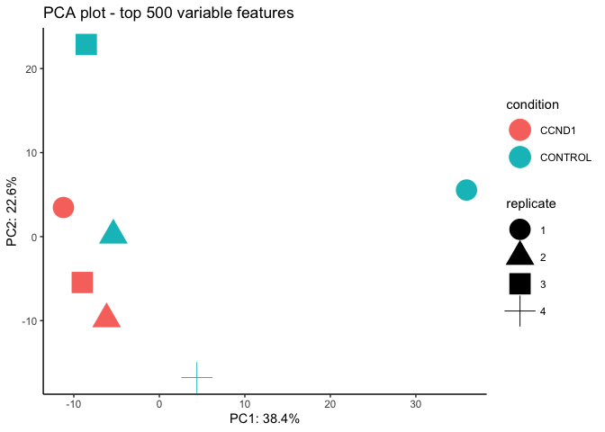
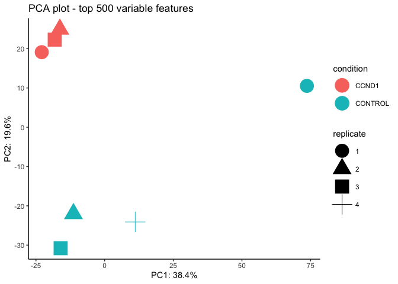
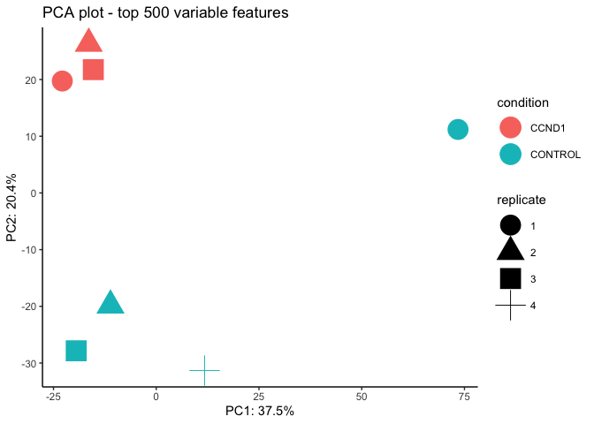

# Introduction

Here we presented the usage of FragPipeAnalystR to reproduce AP-MS analysis previously demonstrated in the manuscript. Note that in the manuscript, we used the FragPipeAnalyst website, but you could reproduce the same analysis with FragPipeR.

## Reading input files

```r
library(FragPipeAnalystR)
se <- make_se_from_files("/Users/hsiaoyi/Documents/workspace/FragPipeR_manuscript/data/AP-MS/combined_protein.tsv",
                         "/Users/hsiaoyi/Documents/workspace/FragPipeR_manuscript/data/AP-MS/experiment_annotation.tsv",
                         type = "LFQ", level = "protein")
```


```r
plot_pca(se)
```

<!-- -->


```r
plot_correlation_heatmap(se)
```

<!-- -->


```r
plot_missval_heatmap(se)
```

<!-- -->


```r
plot_feature_numbers(se)
```

<!-- -->


```r
colData(se)$condition
```

```
## [1] "CCND1"   "CCND1"   "CCND1"   "CONTROL" "CONTROL" "CONTROL" "CONTROL"
```

## Imputation

```r
imputed_se <- manual_impute(se)
```


```r
plot_pca(imputed_se)
```

<!-- -->


```r
plot_correlation_heatmap(imputed_se)
```

<!-- -->

## Differential expression analysis

```r
de_result <- test_limma(imputed_se, type = "all")
```

```
## Tested contrasts: CCND1_vs_CONTROL
```

```r
de_result_updated <- add_rejections(de_result)
plot_volcano(de_result_updated, "CCND1_vs_CONTROL")
```

<!-- -->


```r
sessionInfo()
```

```
## R version 4.3.1 Patched (2023-10-12 r85331)
## Platform: aarch64-apple-darwin20 (64-bit)
## Running under: macOS Ventura 13.4
## 
## Matrix products: default
## BLAS:   /Library/Frameworks/R.framework/Versions/4.3-arm64/Resources/lib/libRblas.0.dylib 
## LAPACK: /Library/Frameworks/R.framework/Versions/4.3-arm64/Resources/lib/libRlapack.dylib;  LAPACK version 3.11.0
## 
## locale:
## [1] en_US.UTF-8/en_US.UTF-8/en_US.UTF-8/C/en_US.UTF-8/en_US.UTF-8
## 
## time zone: America/Detroit
## tzcode source: internal
## 
## attached base packages:
## [1] stats     graphics  grDevices datasets  utils     methods   base     
## 
## other attached packages:
## [1] FragPipeAnalystR_0.1.4
## 
## loaded via a namespace (and not attached):
##   [1] bitops_1.0-7                fdrtool_1.2.17             
##   [3] rlang_1.1.3                 magrittr_2.0.3             
##   [5] clue_0.3-65                 GetoptLong_1.0.5           
##   [7] matrixStats_1.3.0           compiler_4.3.1             
##   [9] png_0.1-8                   vctrs_0.6.5                
##  [11] stringr_1.5.1               ProtGenerics_1.34.0        
##  [13] pkgconfig_2.0.3             shape_1.4.6.1              
##  [15] crayon_1.5.2                fastmap_1.1.1              
##  [17] XVector_0.42.0              labeling_0.4.3             
##  [19] utf8_1.2.4                  rmarkdown_2.26             
##  [21] tzdb_0.4.0                  preprocessCore_1.64.0      
##  [23] purrr_1.0.2                 xfun_0.43                  
##  [25] zlibbioc_1.48.2             cachem_1.0.8               
##  [27] SNFtool_2.3.1               GenomeInfoDb_1.38.8        
##  [29] jsonlite_1.8.8              ExPosition_2.8.23          
##  [31] highr_0.10                  DelayedArray_0.28.0        
##  [33] BiocParallel_1.36.0         parallel_4.3.1             
##  [35] cluster_2.1.4               R6_2.5.1                   
##  [37] stringi_1.8.3               bslib_0.7.0                
##  [39] RColorBrewer_1.1-3          limma_3.58.1               
##  [41] GenomicRanges_1.54.1        jquerylib_0.1.4            
##  [43] assertthat_0.2.1            Rcpp_1.0.12                
##  [45] SummarizedExperiment_1.32.0 iterators_1.0.14           
##  [47] knitr_1.46                  readr_2.1.5                
##  [49] flowCore_2.14.2             IRanges_2.36.0             
##  [51] Matrix_1.6-1.1              tidyselect_1.2.1           
##  [53] rstudioapi_0.16.0           abind_1.4-5                
##  [55] yaml_2.3.8                  doParallel_1.0.17          
##  [57] codetools_0.2-19            affy_1.80.0                
##  [59] lattice_0.21-9              tibble_3.2.1               
##  [61] plyr_1.8.9                  withr_3.0.0                
##  [63] Biobase_2.62.0              evaluate_0.23              
##  [65] ConsensusClusterPlus_1.66.0 circlize_0.4.16            
##  [67] pillar_1.9.0                affyio_1.72.0              
##  [69] BiocManager_1.30.22         MatrixGenerics_1.14.0      
##  [71] renv_0.17.0                 foreach_1.5.2              
##  [73] stats4_4.3.1                plotly_4.10.4              
##  [75] MSnbase_2.28.1              MALDIquant_1.22.2          
##  [77] ncdf4_1.22                  generics_0.1.3             
##  [79] RCurl_1.98-1.14             hms_1.1.3                  
##  [81] S4Vectors_0.40.2            ggplot2_3.5.1              
##  [83] munsell_0.5.1               scales_1.3.0               
##  [85] glue_1.7.0                  lazyeval_0.2.2             
##  [87] tools_4.3.1                 data.table_1.15.4          
##  [89] mzID_1.40.0                 vsn_3.70.0                 
##  [91] mzR_2.36.0                  XML_3.99-0.16.1            
##  [93] grid_4.3.1                  impute_1.76.0              
##  [95] tidyr_1.3.1                 RProtoBufLib_2.14.1        
##  [97] prettyGraphs_2.1.6          MsCoreUtils_1.14.1         
##  [99] colorspace_2.1-0            GenomeInfoDbData_1.2.11    
## [101] cmapR_1.14.0                cli_3.6.2                  
## [103] fansi_1.0.6                 viridisLite_0.4.2          
## [105] cytolib_2.14.1              S4Arrays_1.2.1             
## [107] ComplexHeatmap_2.18.0       dplyr_1.1.4                
## [109] pcaMethods_1.94.0           gtable_0.3.5               
## [111] sass_0.4.9                  digest_0.6.35              
## [113] BiocGenerics_0.48.1         ggrepel_0.9.5              
## [115] SparseArray_1.2.4           farver_2.1.1               
## [117] htmlwidgets_1.6.4           rjson_0.2.21               
## [119] htmltools_0.5.8.1           lifecycle_1.0.4            
## [121] httr_1.4.7                  alluvial_0.1-2             
## [123] GlobalOptions_0.1.2         statmod_1.5.0              
## [125] MASS_7.3-60
```
