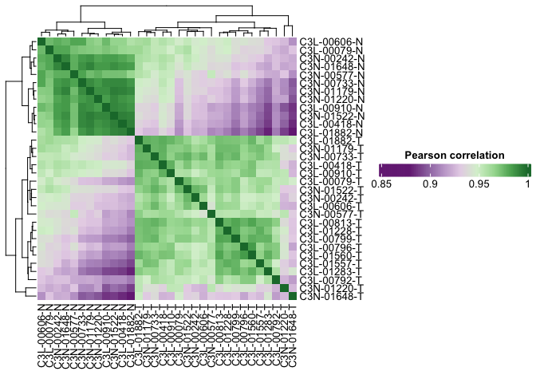
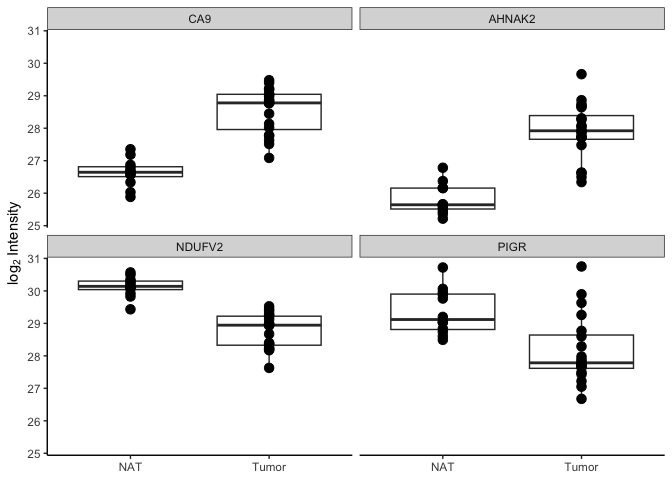
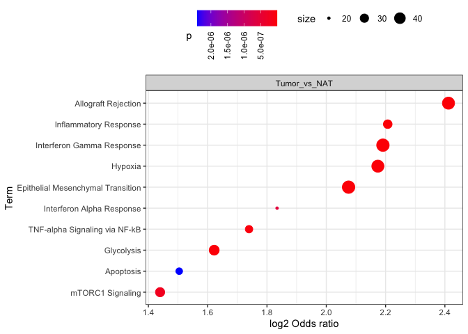

# Introduction

FragPipeAnalystR is a R package intended for FragPipe downstream analysis. We also make it compatible with the result obtained from FragPipe-Analyst. Users are able to reproduce and customize the plots generated in FragPipe-Analyst. You can download the example files from [here](https://zenodo.org/records/13147961). Files are in "TMT_4plex" folder.

## Quick Start Example

``` r
library(FragPipeAnalystR)
```

```
## 
```

``` r
ccrcc <- make_se_from_files("/Users/hsiaoyi/Documents/workspace/FragPipeR_manuscript/data/TMT_4plex/ratio_protein_MD.tsv",
                         "/Users/hsiaoyi/Documents/workspace/FragPipeR_manuscript/data/TMT_4plex/experiment_annotation_clean.tsv",
                         type = "TMT", level = "protein")
```


``` r
plot_pca(ccrcc)
```

<!-- -->


``` r
plot_correlation_heatmap(ccrcc)
```

<!-- -->


``` r
plot_missval_heatmap(ccrcc)
```

```
## `use_raster` is automatically set to TRUE for a matrix with more than
## 2000 rows. You can control `use_raster` argument by explicitly setting
## TRUE/FALSE to it.
## 
## Set `ht_opt$message = FALSE` to turn off this message.
```

```
## 'magick' package is suggested to install to give better rasterization.
## 
## Set `ht_opt$message = FALSE` to turn off this message.
```

<!-- -->


``` r
plot_feature_numbers(ccrcc)
```

<!-- -->


``` r
plot_cvs(ccrcc)
```

<!-- -->

You may want to check some of known markers through box plots:


``` r
plot_feature(ccrcc,  c("Q16790", # CA9
                      "Q8IVF2", # AHNAK2
                      "P19404", # NDUFV2
                      "P01833" # PIGR
                      ))
```

<!-- -->

This could be done via `Gene` column as well:


``` r
plot_feature(ccrcc, c("CA9", "AHNAK2", "NDUFV2", "PIGR"), index="Gene")
```

<!-- -->


``` r
de_result <- test_limma(ccrcc, type = "all")
```

```
## Tested contrasts: Tumor_vs_NAT
```

``` r
de_result_updated <- add_rejections(de_result)
```

Volcano plot is designed for visualizing differential expression analysis result:


``` r
plot_volcano(de_result_updated, "Tumor_vs_NAT")
```

<!-- -->

It could be labelled by different column available in the `rowData(de_result_updated)` such as `Gene`:


``` r
plot_volcano(de_result_updated, "Tumor_vs_NAT", name_col="Gene")
```

<!-- -->


``` r
or_result <- or_test(de_result_updated, database = "Hallmark", direction = "UP")
```

```
## Background
```

```
## Uploading data to Enrichr... Done.
##   Querying MSigDB_Hallmark_2020... Done.
## Parsing results... Done.
```

```
## Tumor_vs_NAT
```

```
## 772 genes are submitted
```

```
## Uploading data to Enrichr... Done.
##   Querying MSigDB_Hallmark_2020... Done.
## Parsing results... Done.
## Background correction... Done.
```

``` r
plot_or(or_result)
```

<!-- -->


``` r
or_result <- or_test(de_result_updated, database = "Hallmark", direction = "DOWN")
```

```
## Background
```

```
## Uploading data to Enrichr... Done.
##   Querying MSigDB_Hallmark_2020... Done.
## Parsing results... Done.
```

```
## Tumor_vs_NAT
```

```
## 1431 genes are submitted
```

```
## Uploading data to Enrichr... Done.
##   Querying MSigDB_Hallmark_2020... Done.
## Parsing results... Done.
## Background correction... Done.
```

``` r
plot_or(or_result)
```

<!-- -->


``` r
sessionInfo()
```

```
## R version 4.4.1 (2024-06-14)
## Platform: aarch64-apple-darwin20
## Running under: macOS Ventura 13.4
## 
## Matrix products: default
## BLAS:   /Library/Frameworks/R.framework/Versions/4.4-arm64/Resources/lib/libRblas.0.dylib 
## LAPACK: /Library/Frameworks/R.framework/Versions/4.4-arm64/Resources/lib/libRlapack.dylib;  LAPACK version 3.12.0
## 
## locale:
## [1] en_US.UTF-8/en_US.UTF-8/en_US.UTF-8/C/en_US.UTF-8/en_US.UTF-8
## 
## time zone: America/Detroit
## tzcode source: internal
## 
## attached base packages:
## [1] stats     graphics  grDevices datasets  utils     methods   base     
## 
## other attached packages:
## [1] FragPipeAnalystR_1.0.5
## 
## loaded via a namespace (and not attached):
##   [1] RColorBrewer_1.1-3          rstudioapi_0.17.1          
##   [3] jsonlite_1.8.9              shape_1.4.6.1              
##   [5] MultiAssayExperiment_1.32.0 magrittr_2.0.3             
##   [7] ggtangle_0.0.6              farver_2.1.2               
##   [9] MALDIquant_1.22.3           rmarkdown_2.29             
##  [11] GlobalOptions_0.1.2         fs_1.6.5                   
##  [13] zlibbioc_1.52.0             vctrs_0.6.5                
##  [15] memoise_2.0.1               ggtree_3.14.0              
##  [17] htmltools_0.5.8.1           S4Arrays_1.6.0             
##  [19] curl_6.2.0                  gridGraphics_0.5-1         
##  [21] SparseArray_1.6.1           mzID_1.44.0                
##  [23] sass_0.4.9                  bslib_0.9.0                
##  [25] htmlwidgets_1.6.4           plyr_1.8.9                 
##  [27] plotly_4.10.4               impute_1.80.0              
##  [29] cachem_1.1.0                igraph_2.1.4               
##  [31] lifecycle_1.0.4             iterators_1.0.14           
##  [33] pkgconfig_2.0.3             gson_0.1.0                 
##  [35] Matrix_1.7-0                R6_2.5.1                   
##  [37] fastmap_1.2.0               GenomeInfoDbData_1.2.13    
##  [39] MatrixGenerics_1.18.1       clue_0.3-66                
##  [41] fdrtool_1.2.18              aplot_0.2.4                
##  [43] digest_0.6.37               enrichplot_1.26.6          
##  [45] pcaMethods_1.98.0           colorspace_2.1-1           
##  [47] patchwork_1.3.0             AnnotationDbi_1.68.0       
##  [49] S4Vectors_0.44.0            GenomicRanges_1.58.0       
##  [51] RSQLite_2.3.9               labeling_0.4.3             
##  [53] cytolib_2.18.2              httr_1.4.7                 
##  [55] abind_1.4-8                 compiler_4.4.1             
##  [57] withr_3.0.2                 bit64_4.6.0-1              
##  [59] doParallel_1.0.17           ConsensusClusterPlus_1.70.0
##  [61] BiocParallel_1.40.0         DBI_1.2.3                  
##  [63] ExPosition_2.8.23           R.utils_2.12.3             
##  [65] MASS_7.3-60.2               prettyGraphs_2.1.6         
##  [67] DelayedArray_0.32.0         rjson_0.2.23               
##  [69] mzR_2.40.0                  tools_4.4.1                
##  [71] PSMatch_1.10.0              ape_5.8-1                  
##  [73] R.oo_1.27.0                 glue_1.8.0                 
##  [75] nlme_3.1-164                QFeatures_1.16.0           
##  [77] GOSemSim_2.32.0             grid_4.4.1                 
##  [79] cmapR_1.18.0                cluster_2.1.6              
##  [81] reshape2_1.4.4              fgsea_1.32.2               
##  [83] generics_0.1.3              gtable_0.3.6               
##  [85] tzdb_0.4.0                  R.methodsS3_1.8.2          
##  [87] preprocessCore_1.68.0       tidyr_1.3.1                
##  [89] hms_1.1.3                   data.table_1.16.4          
##  [91] XVector_0.46.0              BiocGenerics_0.52.0        
##  [93] ggrepel_0.9.6               foreach_1.5.2              
##  [95] pillar_1.10.1               stringr_1.5.1              
##  [97] yulab.utils_0.2.0           limma_3.62.2               
##  [99] flowCore_2.18.0             circlize_0.4.16            
## [101] splines_4.4.1               dplyr_1.1.4                
## [103] treeio_1.30.0               lattice_0.22-6             
## [105] renv_1.1.0                  bit_4.5.0.1                
## [107] RProtoBufLib_2.18.0         tidyselect_1.2.1           
## [109] GO.db_3.20.0                ComplexHeatmap_2.22.0      
## [111] Biostrings_2.74.1           alluvial_0.1-2             
## [113] knitr_1.49                  IRanges_2.40.1             
## [115] ProtGenerics_1.38.0         SummarizedExperiment_1.36.0
## [117] stats4_4.4.1                xfun_0.50                  
## [119] Biobase_2.66.0              statmod_1.5.0              
## [121] MSnbase_2.32.0              matrixStats_1.5.0          
## [123] stringi_1.8.4               UCSC.utils_1.2.0           
## [125] ggfun_0.1.8                 lazyeval_0.2.2             
## [127] yaml_2.3.10                 evaluate_1.0.3             
## [129] codetools_0.2-20            MsCoreUtils_1.18.0         
## [131] tibble_3.2.1                qvalue_2.38.0              
## [133] BiocManager_1.30.25         ggplotify_0.1.2            
## [135] cli_3.6.3                   affyio_1.76.0              
## [137] munsell_0.5.1               jquerylib_0.1.4            
## [139] Rcpp_1.0.14                 GenomeInfoDb_1.42.3        
## [141] png_0.1-8                   XML_3.99-0.18              
## [143] parallel_4.4.1              assertthat_0.2.1           
## [145] readr_2.1.5                 ggplot2_3.5.1              
## [147] blob_1.2.4                  clusterProfiler_4.14.4     
## [149] DOSE_4.0.0                  AnnotationFilter_1.30.0    
## [151] viridisLite_0.4.2           tidytree_0.4.6             
## [153] scales_1.3.0                affy_1.84.0                
## [155] ncdf4_1.23                  purrr_1.0.2                
## [157] crayon_1.5.3                GetoptLong_1.0.5           
## [159] rlang_1.1.5                 cowplot_1.1.3              
## [161] fastmatch_1.1-6             vsn_3.74.0                 
## [163] KEGGREST_1.46.0             SNFtool_2.3.1
```
