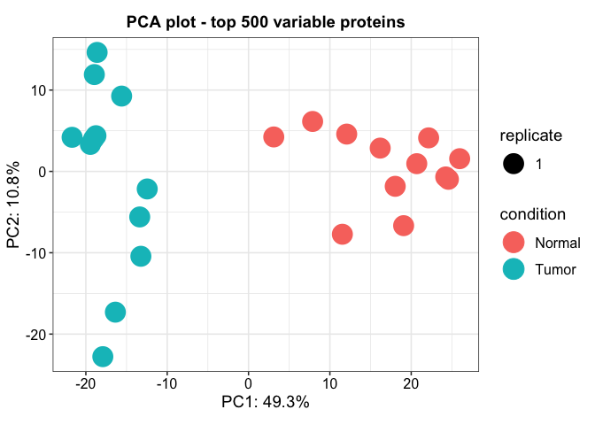
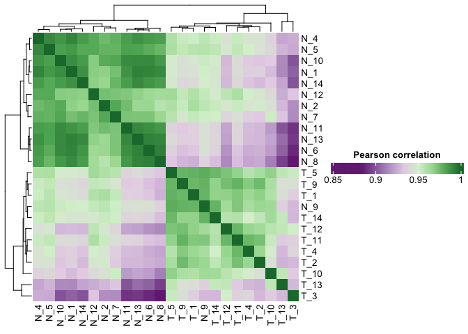
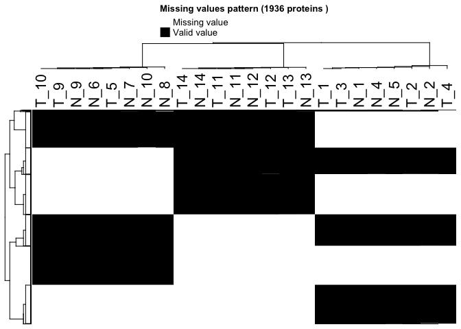

# Introduction

FragPipeAnalystR is a R package intended for FragPipe downstream analysis. We also make it compatible with the result obtained from FragPipe-Analyst. Users are able to reproduce and customize the plots generated in FragPipe-Analyst.

## Quick Start Example

```r
library(FragPipeAnalystR)
data("ccrcc", package = "FragPipeAnalystR")
```


```r
plot_pca(ccrcc, n=500, ID_col="label", exp="TMT")
```

<!-- -->


```r
plot_correlation_heatmap(ccrcc, indicate="condition", exp="TMT")
```

<!-- -->


```r
plot_missval_heatmap(ccrcc)
```

<!-- -->
