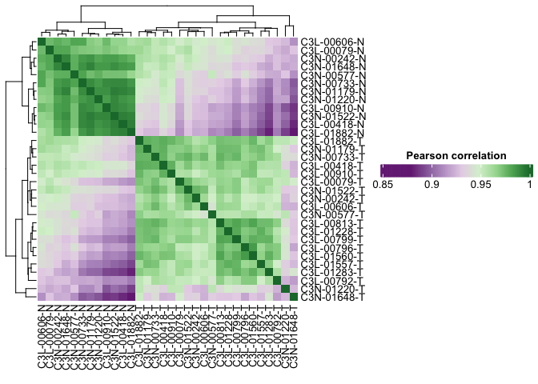
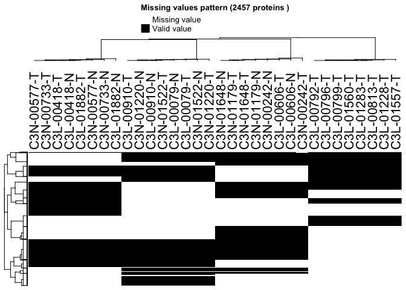
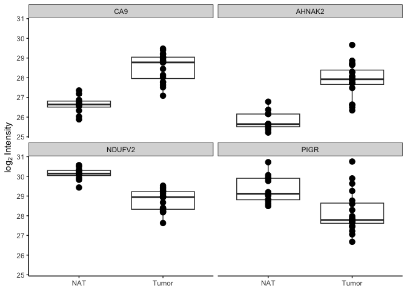
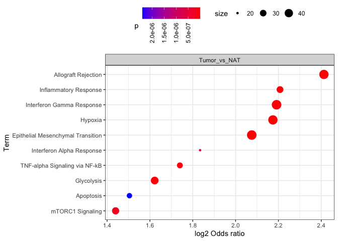

# Introduction

FragPipeAnalystR is a R package intended for FragPipe downstream analysis. We also make it compatible with the result obtained from FragPipe-Analyst. Users are able to reproduce and customize the plots generated in FragPipe-Analyst.

## Quick Start Example

``` r
library(FragPipeAnalystR)
```

```
## 
```

``` r
data("ccrcc", package = "FragPipeAnalystR")
```


``` r
print(metadata(ccrcc))
```

```
## $exp
## [1] "TMT"
## 
## $lfq_type
## NULL
## 
## $level
## [1] "gene"
## 
## $log2transform
## [1] FALSE
```


``` r
print(head(rownames(ccrcc)))
```

```
## [1] "A1BG"  "A1CF"  "A2M"   "AAAS"  "AACS"  "AADAC"
```


``` r
print(colnames(rowData(ccrcc)))
```

```
## [1] "Index"              "NumberPSM"          "ProteinID"         
## [4] "MaxPepProb"         "ReferenceIntensity" "name"              
## [7] "ID"
```


``` r
print(head(rowData(ccrcc)$ID))
```

```
## [1] "A1BG"  "A1CF"  "A2M"   "AAAS"  "AACS"  "AADAC"
```


``` r
plot_pca(ccrcc)
```

<!-- -->


``` r
plot_correlation_heatmap(ccrcc)
```

<!-- -->


``` r
plot_missval_heatmap(ccrcc)
```

```
## `use_raster` is automatically set to TRUE for a matrix with more than
## 2000 rows. You can control `use_raster` argument by explicitly setting
## TRUE/FALSE to it.
## 
## Set `ht_opt$message = FALSE` to turn off this message.
```

```
## 'magick' package is suggested to install to give better rasterization.
## 
## Set `ht_opt$message = FALSE` to turn off this message.
```

<!-- -->


``` r
plot_feature_numbers(ccrcc)
```

<!-- -->


``` r
plot_feature(ccrcc, c("CA9", "AHNAK2", "NDUFV2", "PIGR"))
```

<!-- -->


``` r
de_result <- test_limma(ccrcc, type = "all")
```

```
## Tested contrasts: Tumor_vs_NAT
```

``` r
de_result_updated <- add_rejections(de_result)
```


``` r
plot_volcano(de_result_updated, "Tumor_vs_NAT")
```

<!-- -->


``` r
or_result <- or_test(de_result_updated, database = "Hallmark", direction = "UP")
```

```
## Background
```

```
## Uploading data to Enrichr... Done.
##   Querying MSigDB_Hallmark_2020... Done.
## Parsing results... Done.
```

```
## Tumor_vs_NAT
```

```
## 774 genes are submitted
```

```
## Uploading data to Enrichr... Done.
##   Querying MSigDB_Hallmark_2020... Done.
## Parsing results... Done.
## Background correction... Done.
```

``` r
plot_or(or_result)
```

<!-- -->


``` r
or_result <- or_test(de_result_updated, database = "Hallmark", direction = "DOWN")
```

```
## Background
```

```
## Uploading data to Enrichr... Done.
##   Querying MSigDB_Hallmark_2020... Done.
## Parsing results... Done.
```

```
## Tumor_vs_NAT
```

```
## 1432 genes are submitted
```

```
## Uploading data to Enrichr... Done.
##   Querying MSigDB_Hallmark_2020... Done.
## Parsing results... Done.
## Background correction... Done.
```

``` r
plot_or(or_result)
```

<!-- -->


``` r
sessionInfo()
```

```
## R version 4.3.1 Patched (2023-10-12 r85331)
## Platform: aarch64-apple-darwin20 (64-bit)
## Running under: macOS Ventura 13.4
## 
## Matrix products: default
## BLAS:   /Library/Frameworks/R.framework/Versions/4.3-arm64/Resources/lib/libRblas.0.dylib 
## LAPACK: /Library/Frameworks/R.framework/Versions/4.3-arm64/Resources/lib/libRlapack.dylib;  LAPACK version 3.11.0
## 
## locale:
## [1] en_US.UTF-8/en_US.UTF-8/en_US.UTF-8/C/en_US.UTF-8/en_US.UTF-8
## 
## time zone: America/Detroit
## tzcode source: internal
## 
## attached base packages:
## [1] stats     graphics  grDevices datasets  utils     methods   base     
## 
## other attached packages:
## [1] FragPipeAnalystR_0.1.7
## 
## loaded via a namespace (and not attached):
##   [1] splines_4.3.1               prettyGraphs_2.1.6         
##   [3] bitops_1.0-7                ggplotify_0.1.2            
##   [5] tibble_3.2.1                polyclip_1.10-6            
##   [7] preprocessCore_1.64.0       XML_3.99-0.16.1            
##   [9] lifecycle_1.0.4             doParallel_1.0.17          
##  [11] lattice_0.21-9              MASS_7.3-60                
##  [13] magrittr_2.0.3              limma_3.58.1               
##  [15] plotly_4.10.4               sass_0.4.9                 
##  [17] rmarkdown_2.27              jquerylib_0.1.4            
##  [19] yaml_2.3.8                  cowplot_1.1.3              
##  [21] MsCoreUtils_1.14.1          DBI_1.2.2                  
##  [23] RColorBrewer_1.1-3          ConsensusClusterPlus_1.66.0
##  [25] abind_1.4-5                 zlibbioc_1.48.2            
##  [27] GenomicRanges_1.54.1        purrr_1.0.2                
##  [29] ggraph_2.2.1                BiocGenerics_0.48.1        
##  [31] RCurl_1.98-1.14             yulab.utils_0.1.4          
##  [33] tweenr_2.0.3                circlize_0.4.16            
##  [35] GenomeInfoDbData_1.2.11     IRanges_2.36.0             
##  [37] S4Vectors_0.40.2            enrichplot_1.22.0          
##  [39] ggrepel_0.9.5               tidytree_0.4.6             
##  [41] MSnbase_2.28.1              ncdf4_1.22                 
##  [43] codetools_0.2-19            DelayedArray_0.28.0        
##  [45] DOSE_3.28.2                 ggforce_0.4.2              
##  [47] tidyselect_1.2.1            shape_1.4.6.1              
##  [49] aplot_0.2.2                 farver_2.1.2               
##  [51] viridis_0.6.5               matrixStats_1.3.0          
##  [53] stats4_4.3.1                jsonlite_1.8.8             
##  [55] GetoptLong_1.0.5            tidygraph_1.3.1            
##  [57] iterators_1.0.14            foreach_1.5.2              
##  [59] tools_4.3.1                 treeio_1.29.0              
##  [61] Rcpp_1.0.12                 glue_1.7.0                 
##  [63] gridExtra_2.3               SparseArray_1.2.4          
##  [65] xfun_0.44                   qvalue_2.34.0              
##  [67] MatrixGenerics_1.14.0       GenomeInfoDb_1.38.8        
##  [69] dplyr_1.1.4                 withr_3.0.0                
##  [71] BiocManager_1.30.23         alluvial_0.1-2             
##  [73] fastmap_1.2.0               SNFtool_2.3.1              
##  [75] fansi_1.0.6                 cmapR_1.14.0               
##  [77] digest_0.6.35               R6_2.5.1                   
##  [79] gridGraphics_0.5-1          colorspace_2.1-0           
##  [81] GO.db_3.18.0                RSQLite_2.3.6              
##  [83] utf8_1.2.4                  tidyr_1.3.1                
##  [85] generics_0.1.3              renv_0.17.0                
##  [87] data.table_1.15.4           graphlayouts_1.1.1         
##  [89] httr_1.4.7                  htmlwidgets_1.6.4          
##  [91] S4Arrays_1.2.1              scatterpie_0.2.3           
##  [93] pkgconfig_2.0.3             gtable_0.3.5               
##  [95] blob_1.2.4                  ComplexHeatmap_2.18.0      
##  [97] RProtoBufLib_2.14.1         impute_1.76.0              
##  [99] XVector_0.42.0              clusterProfiler_4.10.1     
## [101] shadowtext_0.1.3            htmltools_0.5.8.1          
## [103] fgsea_1.28.0                MALDIquant_1.22.2          
## [105] ProtGenerics_1.34.0         clue_0.3-65                
## [107] scales_1.3.0                Biobase_2.62.0             
## [109] png_0.1-8                   ggfun_0.1.4                
## [111] knitr_1.46                  rstudioapi_0.16.0          
## [113] tzdb_0.4.0                  reshape2_1.4.4             
## [115] rjson_0.2.21                curl_5.2.1                 
## [117] nlme_3.1-163                cachem_1.1.0               
## [119] GlobalOptions_0.1.2         stringr_1.5.1              
## [121] parallel_4.3.1              HDO.db_0.99.1              
## [123] ExPosition_2.8.23           AnnotationDbi_1.64.1       
## [125] mzID_1.40.0                 vsn_3.70.0                 
## [127] pillar_1.9.0                grid_4.3.1                 
## [129] vctrs_0.6.5                 pcaMethods_1.94.0          
## [131] cytolib_2.14.1              cluster_2.1.4              
## [133] evaluate_0.23               readr_2.1.5                
## [135] cli_3.6.2                   compiler_4.3.1             
## [137] rlang_1.1.3                 crayon_1.5.2               
## [139] labeling_0.4.3              fdrtool_1.2.17             
## [141] affy_1.80.0                 flowCore_2.14.2            
## [143] plyr_1.8.9                  fs_1.6.4                   
## [145] stringi_1.8.4               viridisLite_0.4.2          
## [147] BiocParallel_1.36.0         assertthat_0.2.1           
## [149] munsell_0.5.1               Biostrings_2.70.3          
## [151] lazyeval_0.2.2              GOSemSim_2.28.1            
## [153] Matrix_1.6-1.1              hms_1.1.3                  
## [155] patchwork_1.2.0             bit64_4.0.5                
## [157] ggplot2_3.5.1               KEGGREST_1.42.0            
## [159] statmod_1.5.0               highr_0.10                 
## [161] SummarizedExperiment_1.32.0 mzR_2.36.0                 
## [163] igraph_2.0.3                memoise_2.0.1              
## [165] affyio_1.72.0               bslib_0.7.0                
## [167] ggtree_3.10.1               fastmatch_1.1-4            
## [169] bit_4.0.5                   ape_5.8                    
## [171] gson_0.1.0
```
